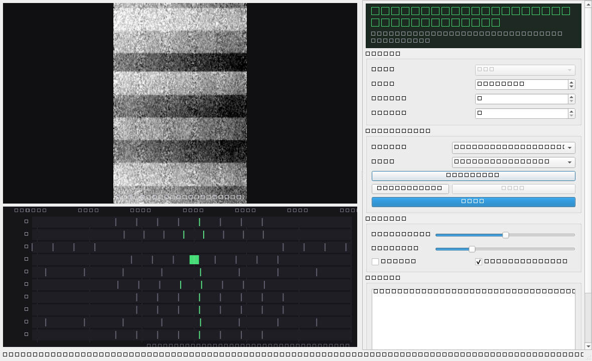

# FPV RF: band search, channel select, and alerting

Decodes analogue FPV video straight out of HackRF IQ — no capture card, no
driver — searches the 5.8 GHz band for energy above the noise floor, names what
it finds on the VTX band chart, and alerts with **band + channel + frequency**.

```
python main.py                                     # sim source, works with no hardware
python main.py --mode hackrf --frequency 5802      # a real HackRF
python main.py --mode file --file capture.u8 --capture-frequency 5802
python main.py --check                             # verify a source and exit
```

MIT licensed. See [LICENSE](LICENSE).

## Requirements

Python 3.12 or newer, and:

```
pip install -r requirements.txt
```

That is three packages — numpy, scipy, PySide6 — and it is deliberately all the
**application** needs. `fpv_rf` never imports Pillow: the picture downscale is
`scipy.ndimage.zoom` rather than a resize, so the packaged `.exe` does not carry
an imaging library it would not otherwise use.

To run the checks as well, which need one more:

```
pip install -r requirements-dev.txt
```

Five scripts under `tools/` use Pillow, and only to write a PNG of a decoded
frame so a human can look at it. Nothing in the decode path touches it.

## The .exe app

```
python build_exe.py
```

produces **`dist\FPV-RF\FPV-RF.exe`** — double-click it, no console, no Python
needed. The name has no spaces in it on purpose: the first build shipped to
`dist\FPV RF\FPV RF.exe`, and a path with a space in both the folder and the
file has to be quoted everywhere and is awkward to type into a Run box. The
build output should be the one thing in this project that is hard to misplace.

`hackrf_transfer.exe` is copied in beside it, and the app looks for it there
*before* `PATH`, so the copy shipped with the app is the one that runs rather
than some other version found elsewhere on the machine.

The packaged app defaults to `--mode hackrf`, because a double-clicked app
should use the radio plugged into it rather than opening a convincing fake
picture. `--mode sim` still selects the simulator.

It is a **folder, not a single file**, on purpose. A one-file build unpacks its
whole payload to a temp directory on every launch and deletes it afterwards;
with Qt and SciPy that is several hundred megabytes copied to disk each time,
turning a one-second start into a thirty-second one. The folder form starts in
about a second and is a normal application directory you can copy or delete.

Three things a windowed build needs that running from source does not:

- **`find_hackrf_transfer` is frozen-aware.** `__file__` points inside the
  bundle in a packaged build, so the app resolves paths against the directory
  holding the executable.
- **Everything is logged to `fpv-rf.log`** beside the exe. A GUI-subsystem build
  has no console, so `sys.stdout` is `None` and every `print` would vanish —
  which is exactly when diagnostics matter, because a frozen build that
  misbehaves otherwise gives you nothing to look at. stdout and stderr are
  replaced with a tee, so no existing call site changed.
- **Results you would have read off the console come back as a message box.**
  `--check` on the packaged app pops up its report instead of exiting silently,
  which is otherwise indistinguishable from crashing.

### Verifying the packaged build

```
"dist\FPV-RF\FPV-RF.exe" --check          # the radio, in a dialog, then exit
"dist\FPV-RF\FPV-RF.exe" --selftest       # build the real window and test it
```

`--selftest` exists because a packaged build fails in ways a source-tree run
cannot: a missing Qt platform plugin, a data file the packager left out. The
symptom in both cases is a window that never appears, and there is no debugger
attached to an `.exe`. `--selftest` runs the real window offscreen *inside the
frozen build* — the same 16 assertions `check_ui.py` makes — so "the exe is
broken" and "the app is broken" become distinguishable. `build_exe.py` runs it
automatically and will not report success without it passing.

`build_exe.py` runs the self test **first**, before anything opens the radio,
and that ordering is load-bearing rather than cosmetic. The self test measures
sustained decode throughput, so it fails if something else is competing for the
CPU, and tearing a HackRF down immediately before it is exactly that: the first
build ran the radio check first and the self test measured 37.7 fps against a
45 fps gate, while the same binary scored 50-55 fps three times in a row on its
own. The same kind of flakiness is why `bench_sim` is a measurement and not an
assertion.

Measured on the packaged build: **50-59 fps** decode, 16/16 assertions, and
`--check` passing against both the simulator and the live radio. The live radio
correctly reports `noise only` when nothing is transmitting.



---

## What it does

1. **Reads IQ** from a HackRF at 10 MS/s, or replays a capture, or synthesises a
   transmitter.
2. **Decodes FM composite video** — demodulate, de-emphasis, find the sync train,
   rasterise lines into frames. Runs at the field rate.
3. **Searches the band** on a coarse grid, then verifies what it finds properly:
   a full field of samples, a sync-lock test, a line-rate measurement.
4. **Names the channel** from the band chart, and says how sure it is.
5. **Alerts** when energy appears above the noise floor: banner, beep, log.

## The alert

> alert with band + channel + frequency

```
03:18:00  F4 @ 5800 MHz -- decodable NTSC video, sync 100%, SNR 9.7 dB
03:18:00  R1 @ 5658 MHz -- decodable NTSC video, sync 100%, SNR 8.1 dB
03:18:41  LOST  F4 @ 5800 MHz
```

Two things make that readable rather than noise:

**A finding is identified by proximity, not by a label or a frequency grid.** A
9 MHz hop grid can legitimately report the same VTX three megahertz higher on
the next sweep, and 5803 is nearer A4 than F4. Keyed on the label or on a
rounded frequency, one drone becomes two alerts. Instead a new finding adopts the
identity of a known one within 15 MHz — the same width the scanner uses to merge
one wideband transmitter seen across several hops.

**Repeats are counted, not raised.** The first sighting alerts. A sighting
inside the cooldown bumps a counter that the banner shows ("seen 47x"). A
finding that has been absent for longer than the forget window raises a `LOST`
event, and only then is it forgotten — so a drone that lands and takes off again
is a new alert, and a drone that has gone is something you are told rather than
something you have to notice.

A cancelled or empty scan is *not* treated as evidence. `update(None)` is an
incomplete observation, and reporting every channel you did not reach as "lost"
would be a lie.

## The picture is noisy on a real capture, and that is correct

The reference decoder's own output scores +0.8241 against its own ideal, and
that number is reproducible: a bilinear resize of its `raw_frame.png` scores
exactly the same. It is a resampling artefact, not a quality score, and
chasing it wastes time.

The real 5802 MHz capture scores +0.8335 — and it is genuinely noisy. Measured
levels: sync at 3.1243 ± 0.0099, picture p5/50/95/99.5 at
−1.7504 / −1.5452 / 3.0665 / 3.1367, σ 1.4328. Only about 0.5% of picture
samples reach sync level, so there is very little margin between "sync" and
"the brightest thing in the picture", and that is a property of a 5802 MHz
capture taken with a handheld antenna, not a decoder fault.

## Frequency resolution is the hop size, and the app says so

A 10 MS/s tuner knows a transmitter to about half a hop. On the default 9 MHz
grid that is ±4.5 MHz, which is wider than the gap between several chart
channels, so the app reports both:

```
F4 @ 5800 MHz ±4.5 MHz
off-chart 5813 MHz (nearest B5)
```

Chart channels are 19–37 MHz apart, which is why snapping a hop that cleared the
gate to the nearest chart channel is sound — and why a transmitter further from
the chart than the grid can resolve is reported as *off-chart* instead of being
quietly relabelled as a channel number it is not on. The grid is a dropdown:
9 MHz (fast), 5 MHz, or 2 MHz (±1 MHz, four and a half times the work).

A **file** source knows its own frequency, so it reports `F4 @ 5802 MHz` with no
tolerance. That is the difference between replaying a recording and sweeping.

## A HackRF retune is a process restart

`hackrf_transfer` has no in-process retune, so every hop is: kill the process,
start a new one, wait for the tuner to settle. A measured 34-hop sweep of the US
span takes **12.7 s** — 374 ms per hop, nearly all of it the retune. Budget for
that, and for a minute or so on the 2 MHz grid. The sim source retunes
instantly, which is why the scan in the screenshot above reports 0.6 s.

Terminating the old process does *not* wait for it to release the USB device, so
the first spawn after a retune fails outright with `hackrf_open() failed: HackRF
not found (-5)`. That is the normal state, not a fault, and it is retried until
the device appears. Retrying it matters more than it sounds: unretried, that hop
reads an empty band because no samples arrived inside the dwell, and the sweep
silently reports the wrong frequency.

The scan runs on its own thread, so the picture keeps updating while it runs.
That is not a nicety: on hardware the scan is the only thing taking seconds, and
freezing the window for the duration means the operator watches a dead panel
exactly when they are waiting to find out whether their drone is up.

## The HackRF's own DC leakage, and why it is the one thing that had to be measured

With nothing transmitting anywhere in the band, the live HackRF reports a
**52 dB narrowband carrier at +0.00 MHz offset**. At every tuned frequency. It
is the receiver's own local oscillator, and the giveaway is that it does not
move: a real signal holds its frequency while the tuner moves, so it appears at
a different offset in each window, whereas this is dead centre every time.
Measured detail — bin 0 at +52 dB over the floor, bins ±1 at +46 dB, and
nothing else in the entire 10 MHz span more than 3 dB up.

Left in, this is worse than noise, because it is loud, constant, and present at
*every* hop. The coarse pass's secondary test is a bare-carrier peak gate at
12 dB, so all 34 hops would clear it: one sweep would report the whole band
occupied and raise 34 alerts for one receiver.

So every occupancy statistic — the classifier's peak and floor, and the coarse
pass's peak and bin count — is taken over the bins outside a 25 kHz guard band
around DC (`dsp.away_from_dc`). Ignoring it costs nothing real: an FPV downlink
is ~15 MHz wide, so it covers the centre of the window hundreds of times over
and cannot be missed by a 50 kHz hole. The only thing that could hide there is
a carrier engineered to land within 25 kHz of whatever frequency the tuner
happened to be sitting on.

`python tools\check_hardware_scan.py` is the check that matters here, and it is
the one the simulator cannot stand in for — the sim has no LO leak, so its
0-false-positive result said nothing about the real radio. On hardware, with the
band empty:

```
   5650.0          0       2.3      -2.81  quiet
   ...
   5803.0          0       3.8      -4.51  quiet
   ...
   5947.0          0       3.4      -0.82  quiet
34 hops, 0 read as occupied

scanned 5650 MHz..5950 MHz in 34 hops, 12.7 s: nothing above the noise floor
  (loudest quiet hop peaked 5.2 dB over it, gate 12 dB)
candidates: 0, false positives: 0
```

## What the sim is and is not

`SimSource` produces a real FM composite video signal: sync pulses, blanking,
gamma, a per-line ramp, at the right line rate. It sustains 1.00× real time on
one core, so a decoder that cannot keep up with real time is visibly starved
rather than quietly working on a backlog.

It is **deliberately narrowband** — hundreds of kHz of deviation, not the
15 MHz Carson width of a real VTX. That is the one thing it does not model, and
it matters in exactly one place: how far from a transmitter a tuner can still
see it. On the sim, signal exists within ±5 MHz; on hardware, within the full
15 MHz. So a merged finding on the sim spans 10 MHz where hardware would span
15. Everything else — sync detection, rasterising, frame rate, level mapping — is
exercised honestly.

Its quiet-band noise is flat across the span, generated as a first *difference*
of white noise. That is not decoration: a random walk in the deviation has a
Lorentzian spectrum with a huge hump at DC, and a band search finds that hump
every time. Making it flat dropped the coarse gate's false-positive rate to
**0 in 200 independent blocks**.

## Occupancy is decided by sync, not by SNR

Video SNR as measured in the 10 MHz span is a bad test, because a 6.5 MHz
deviation FM signal occupies ~15 MHz — wider than the window it is being
measured in. What separates a video downlink from noise is not how loud it is but
whether there is a **sync train in it**: a few thousand regularly spaced pulses,
lockable, at a line rate that matches a standard.

`dsp.assess_channel` therefore classifies by trying to lock, and reports
`video` / `carrier` / `noise`. Bare carriers are a separate class because a
powered-but-not-streaming VTX and a narrowband interferer are both real and
neither is what you want to watch.

Sync detection is the **97.5th percentile of the signed waveform, unsmoothed**.
This is load-bearing: a 10-tap moving average before the threshold dropped
12120 detected pulses to 9897 and the longest clean run from 254 lines to 85.
Smoothed sync detection is the single most common way to get a plausible-looking
picture that is actually a different picture every frame.

## Layout

```
main.py                 argument parsing, source selection, --check, logging
build_exe.py            package the app as a double-clickable .exe
fpv_rf/dsp.py           demod, de-emphasis, sync, rasteriser, classification
fpv_rf/bands.py         the band plans, frequency -> band/channel, legality
fpv_rf/sdr.py           sources: hackrf_transfer, file replay, simulator
fpv_rf/video.py         frame assembly and the decode thread
fpv_rf/scan.py          two-pass band search, merging, auto-select
fpv_rf/alerts.py        identity, dedupe, cooldown, log, beep
fpv_rf/ui.py            PySide6 window, band chart widget, alert panel
tools/                  the checks below
tools/_paths.py         resolves the optional real capture, no hardcoded paths
tools/check_workflow.py validates .github/workflows/checks.yml before pushing
tools/archive/          development scaffolding; nothing runs it automatically
docs/                   the screenshots this README shows
```

## Checks

```
python tools\check_sources.py     # sim / file / real-capture end to end
python tools\check_scan.py        # band search, merging, off-chart, empty band
python tools\check_alerts.py      # dedupe, cooldown, lost, identity
python tools\check_ui.py          # the real Qt window, offscreen, with screenshots
python tools\check_layout.py      # nothing clipped, nothing squeezed
python tools\check_worker.py      # streaming frame rate
python tools\check_workflow.py    # the CI workflow is valid and self-consistent
python tools\check_hardware_scan.py  # a real sweep of a real, empty band
python tools\bench_sim.py         # the simulator sustains real time
python tools\bench_coarse.py      # the coarse gate's false-positive rate
python tools\diag_edges.py        # proves sync detection locks onto SYNC
python tools\diag_spurs.py        # is that carrier the band, or the radio?
python tools\diag_peak_bin.py     # names the exact bin a "carrier" sits in
python build_exe.py               # build the .exe, then verify it did not break
```

The first nine run with no hardware and no capture. The three after
`check_hardware_scan.py` all need the HackRF plugged in.

### Continuous integration

`.github/workflows/checks.yml` runs the nine on every push and pull request, on
both Linux and Windows, because none of them need a radio. The Windows leg is
not redundant: a missing directory, a hardcoded path and an undeclared
dependency all behave identically on either platform, and the shipping target
with the Windows-only timer, subprocess and `winsound` paths is Windows.

Two things are deliberately **not** gates, and the workflow says so in its own
header rather than leaving it to be inferred:

- `bench_sim.py` measures a wall-clock deadline. On a shared runner any
  co-tenant taking CPU fails the build for a change that did not cause it, so it
  is reported and ignored.
- `check_sources.py` and `check_frame_structure.py` assert no threshold. They
  exist to catch a crash in the end-to-end path, and a non-zero exit still fails
  the step. `check_frame_structure.py` reads frames that other checks wrote, so
  on its own it says what it examined rather than printing nothing.

`check_hardware_scan.py` needs the HackRF and is the only one that needs nothing
transmitting to be meaningful — it asserts the *absence* of a finding. It is
also the one that would have caught the DC leak, and the sim would not have.

`check_worker.py` reports **59.5 fields/s** on a 16.7 ms budget: drain 2.3 ms,
decode 12.7 ms, cycle 17.5 ms, 1.00× real time from the source. The panel
repaints at 60 Hz from the newest frame, so display and decode rates are the same
number for different reasons and neither is the other's bottleneck.

## The optional real capture

Several checks and diagnostics are more convincing against a real HackRF
recording than against the simulator. A capture is 38 MB of IQ, so it is not in
this repository, and `tools/_paths.py` resolves where one is instead of any
tool hardcoding a path. In order:

1. `$FPV_CAPTURE` — a full path to a `.u8` file, or the folder containing it.
2. `samples/r5_5802_g16.u8` in the repository. That folder is gitignored, so
   dropping a capture there is safe.
3. The same filename found by a shallow search of your home directory.

**A fresh clone has none, and that is the normal case.** Everything that needs
one reports `SKIP` and continues; nothing fails. `check_scan.py`, `validate_dsp.py`
and `bench_coarse.py` all exercise the simulator instead, so the suite is
meaningful with no radio and no capture at all.

To record your own with a HackRF on a quiet band:

```
hackrf_transfer -r my.u8 -f 5802000000 -s 10000000 -n 20000000 -l 32 -g 16
$env:FPV_CAPTURE = "C:\path\to\my.u8"
python tools\validate_dsp.py
```

A further handful of scripts in `tools/archive/` need that same capture. They are
development scaffolding: nothing runs them, and `tools/archive/README.md`
explains what each one is for. The repository is self-contained — nothing in it
depends on a project that isn't here.

## Hardware

Tested against a Mayhem firmware build (`n_260505`, API 1.11), serial
`0000000000000000a09867dc391638A3`.

```
hackrf_transfer -r file.u8 -f 5802000000 -s 10000000 -n 20000000 -l 32 -g 16
```

LNA 32, VGA 16, 10 MS/s. `pyhackrf2` is not used: it hardcodes
`libhackrf.so.0` and this machine has no `hackrf.dll`, and the Mayhem build is
statically linked. Streaming is a `hackrf_transfer -r -` subprocess with the
`-r` flag first, because that is where it has to be, and the child's stderr
gets its own thread because on a `bufsize=0` pipe a read on it would otherwise
stall the only path to the samples.

10 MS/s, not 20: NTSC at 60 fields/s needs 10.014 and PAL at 50 needs 9.98, and
20 MS/s costs USB bus contention that shows up as dropped samples. Measured
sustained on the live radio: 20 MB/s, exactly 10 MS/s.
